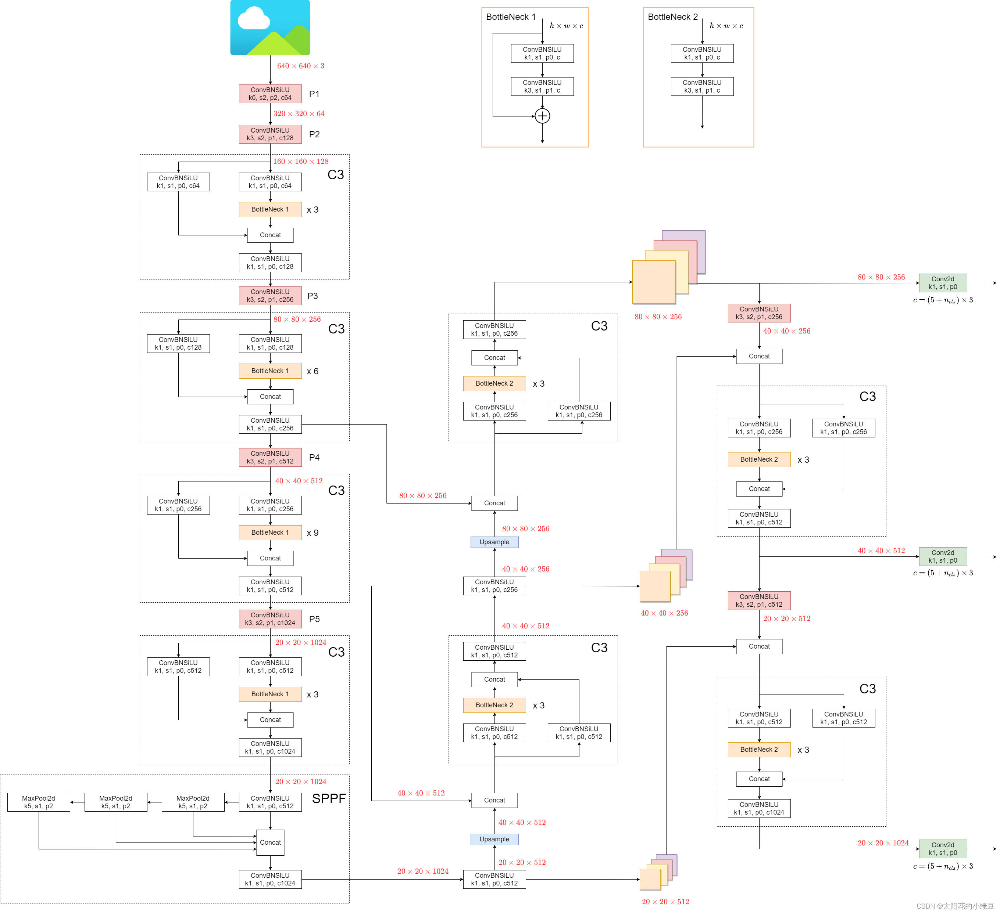

# 学习笔记

## YOLO v5网络学习

### 1.网络结构图




## 文件夹与文件功能

## 1.推理部分之detect.py

### 导包

```python
import argparse
import csv
import os
import platform
import sys
from pathlib import Path

import torch
"""
argparse:
用于编写用户友好的命令行接口。程序定义它需要的参数，然后argparse会自动从sys.argv解析出那些参数。argparse自动生成帮助和使用手册，并在用户给程序传入无效参数时报出错误。
csv:
提供读写CSV（逗号分隔值）文件的功能。CSV文件是一种常用的表格数据文件格式，可以使用Excel等电子表格软件打开。
os:
提供了许多与操作系统交互的功能。os模块是Python的标准库之一，它包含普遍的操作系统功能，如文件和目录的访问和处理、环境变量的获取和设置、程序的执行等。
platform:
用于获取操作系统平台信息的模块。它可以帮助你查询当前操作系统的名称、版本等信息，以及Python解释器的详细信息。
sys:
提供了一系列有关Python运行环境的变量和函数。例如，sys.argv是一个来自命令行的参数列表，sys.exit()是一个退出程序的函数。
Path from pathlib:
pathlib提供了面向对象的文件系统路径操作。Path是pathlib模块中的一个类，用于表示文件系统路径，并提供了简单的路径操作，如读取、写入、遍历目录树等。
torch:
是一个开源的机器学习库，用于应用如计算机视觉和自然语言处理等领域的深度学习算法。torch提供了强大的张量（多维数组）操作，以及自动求导系统，使得构建和训练神经网络变得更加简单。
"""
```

### run()方法

执行推理过程

### parse_opt()方法

解释参数的方法

### main(opt)方法

opt为命令行对象，检查导包，执行run()

